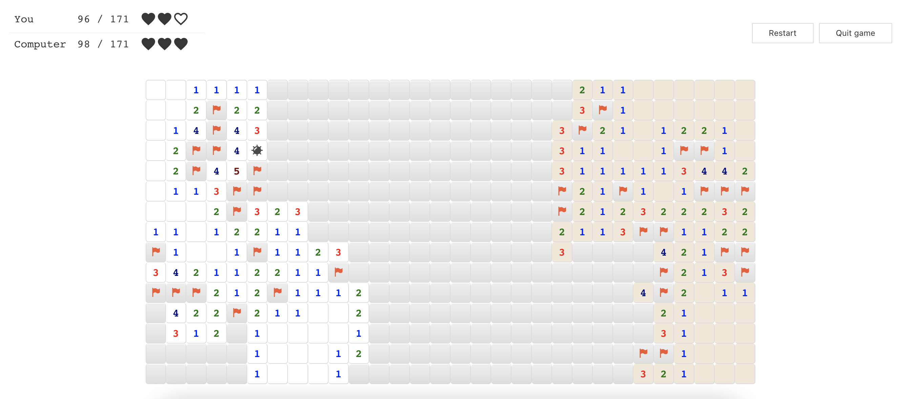

# Minesweeper Battle

[Play game](https://minesweeper-battle.onrender.com/)

### Implementation

Computer engine implemented using [LogicJS](https://github.com/mcsoto/LogicJS) library.
Read more:
* [Algorithms and data structures behind Minesweeper Battle](https://dev.to/krlove/algorithms-and-data-structures-behind-minesweeper-battle-1a70)
* [Creating advanced Minesweeper solver using logic programming](https://dev.to/krlove/creating-advanced-minesweeper-solver-using-logic-programming-2ppd)
